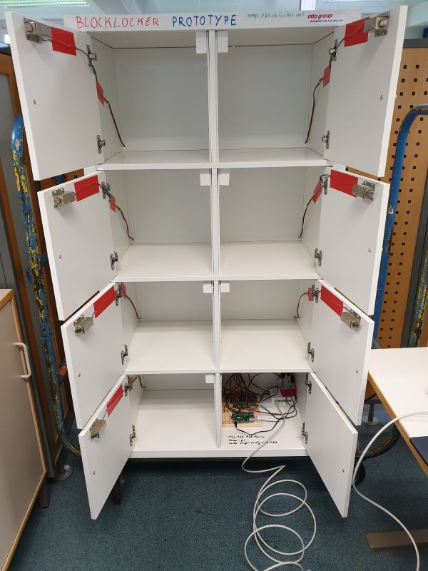
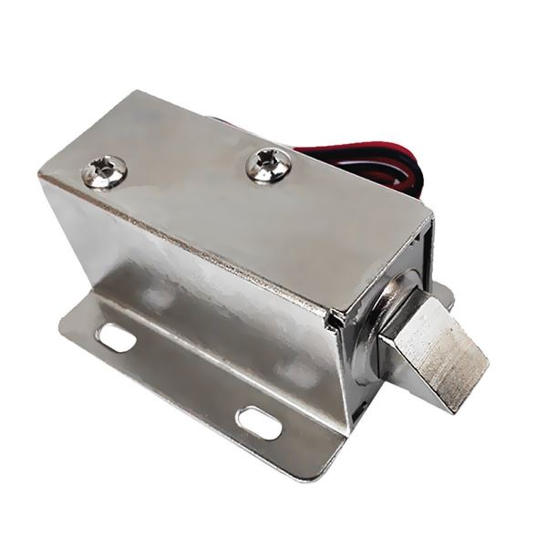
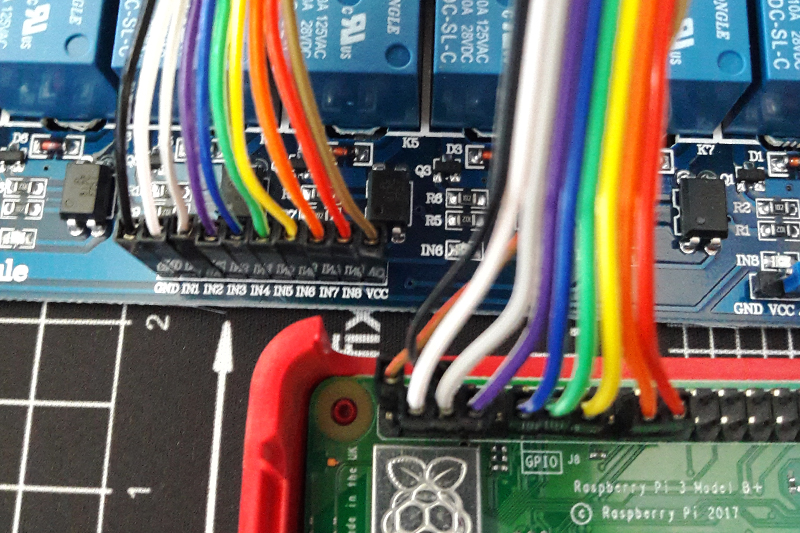
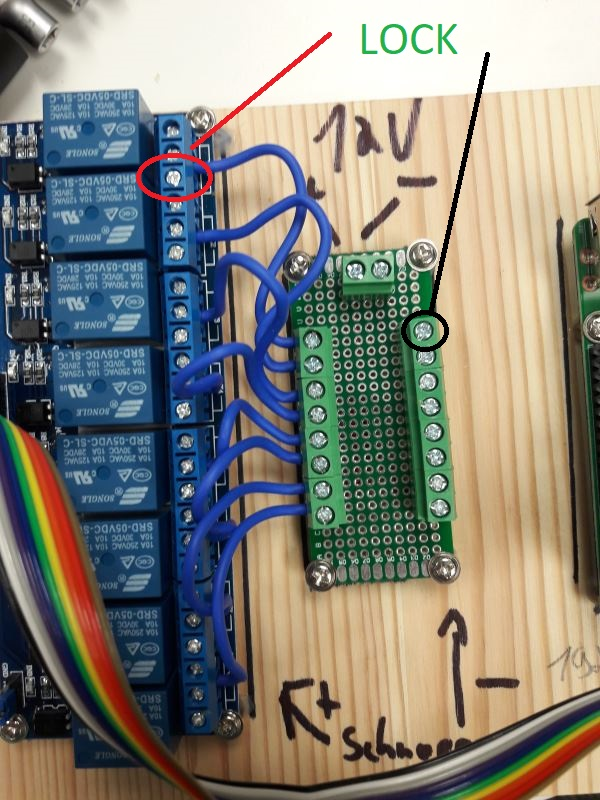

# Locker

> This is the locker for the Blocklocker project. It's a locker with 8 doors and a Raspberry Pi.




## Requirements

1. Raspberry Pi
2. Board with 8 relays (relay module)
3. Cabinet with 8 doors (like IKEA KALLAX with doors)
3. 12V electric door lock (for each door)
4. 12V power supply
5. A few cables to connect everything




## Cabling

Connect the relay board to your Raspberry Pi and the door locks to the relays.

| Relay Module | Raspberry Pi |
|--------------|--------------|
| GND          | Ground       |
| IN1          | GPIO 02      |
| IN2          | GPIO 03      |
| IN3          | GPIO 04      |
| IN4          | GPIO 17      |
| IN5          | GPIO 27      |
| IN6          | GPIO 22      |
| IN7          | GPIO 10      |
| IN8          | GPIO 09      |
| VCC          | DC Power 5v  |

*If you want to use other GPIO pins you can change this in the `door.sh` script.*





Video: https://www.youtube.com/watch?v=oaf_zQcrg7g


Relay:

```
|---\  ---|
(1) (2) (3)
+---------+
| SRD-    |
| 05VCD-  |
| SL-C    |
+---------+
```

Connection:

* OFF: 1 + 2
* GPIO drive high (dh): 1 + 2
* GPIO drive low (dl): 2 + 3

Wiring:

* Connect the 12v power (positive) to relay pin 2.
* Connect the red cable (positive) from the lock to relay pin 3.
* Connect the black cable (negative) from the lock to ground.




## Installation


### Requirements

Tested with Raspbian Stretch Lite ([Download](https://www.raspberrypi.org/downloads/raspbian/)).


Install the following packages:

```
sudo apt-get install raspi-gpio git autossh lighttpd screen nano
```


### Get Source

Clone:

```
cd ~
git clone https://github.com/Cyclenerd/blocklocker.git
```


### Adjust Settings

To copy and configure everything execute the `copy.sh` script:

    cd blocklocker
    bash locker/pi/copy.sh

Edit SSH config. Add IP address or DNS name from the shop back end:

```
nano -w ~/.ssh/config
```

There will be an SSH tunnel to the computer of the shop backend will be established later.
Through this tunnel comes the command to open a door. 
Test:

```
ssh shop-back-end
```


#### Lighttpd

Configure Lighttpd web server.

```
# Remove old index.html
sudo rm /var/www/html/index.lighttpd.html
# Copy CGI Script
sudo cp ~/blocklocker/locker/pi/index.sh /var/www/html/index.sh
# Allow user www-data to execute the "raspi-gpio set" command
sudo cp ~/blocklocker/locker/pi/099_www-data /etc/sudoers.d/
# Edit config
sudo nano -w /etc/lighttpd/lighttpd.conf
```

Extract from the modified file:

```
server.modules = (
        "mod_access",
        "mod_alias",
        "mod_cgi",
        "mod_compress",
        "mod_redirect",
)

index-file.names = ( "index.html", "index.sh" )
static-file.exclude-extensions = ( ".php", ".pl", ".fcgi", ".sh" )
cgi.assign = ( ".sh"  => "/bin/bash")
```

Restart:

```
sudo service lighttpd restart
```


### Background Tasks

All background processes (i.e. `lock.sh` and `ssh.sh`) run in one `screen`.
After the configuration and `reboot` enter `door` to get it in the foreground.

Use key combination <kbd>Ctrl</kbd> + <kbd>a</kbd>, and subsequently pressing a key to execute one of the commands given below:

* <kbd>n</kbd> : switches to the next available console
* <kbd>p</kbd> : switches back to the previous console
* <kbd>c</kbd> : creates a new virtual Bash console
* <kbd>d</kbd> : detatches the current screen sessions and brings you back to the normal terminal


Configure `crontab`:

    crontab -e

Add:

```
# run screen after reboot
@reboot sleep 60 && /usr/bin/screen -d -m
```


### Start

```
sudo reboot
```
