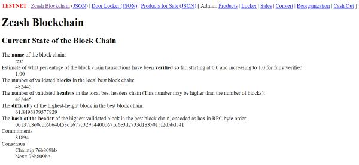

# Shop Back End

> This is the back end of the Blocklocker project. It is a simple Perl application.



## Requirements

Computer with Ubuntu. Other Linux distributions work too. To avoid any problems, I recommend Ubuntu or Debian. Tested with 16.04 LTS.

## Installation

Install the following packages:

    sudo apt-get install -y build-essential sqlite3 libssl-dev libcrypto++-dev zlib1g-dev htop slurm curl nano


Install Perlbrew (https://perlbrew.pl/):

    \curl -L https://install.perlbrew.pl | bash
    perlbrew install perl-5.26.2
    perlbrew switch perl-5.26.2
    cpan -i App::cpanminus

### Install Zcash Client

    sudo apt-get install -y apt-transport-https
    wget -qO - https://apt.z.cash/zcash.asc | sudo apt-key add -
    echo "deb [arch=amd64] https://apt.z.cash/ jessie main" | sudo tee /etc/apt/sources.list.d/zcash.list
    sudo apt-get update && sudo apt-get install zcash
    zcash-fetch-params
    mkdir ~/.zcash
    echo "rpcuser=username" >> ~/.zcash/zcash.conf
    echo "rpcpassword=`head -c 32 /dev/urandom | base64`" >> ~/.zcash/zcash.conf
    # Remember username and password for later configuration
    cat .zcash/zcash.conf

Once you've configured your zcash.conf file, you can start the zcash daemon.

    # Mainnet
    zcashd
    # Testnet
    zcashd --testnet

More help: https://z.cash/download.html

### Get Source

    cd ~
    git clone https://github.com/Cyclenerd/blocklocker.git
    cd blocklocker/shop-back-end

### Install Perl Dependencies

    cpanm --installdeps .

### Create SQLite Database

    cat db/shop.sql | sqlite3 db/shop.sqlite

### Adjust Settings

    # Copy
    cp environments/sample_development.yml environments/development.yml
    cp environments/sample_production.yml environments/production.yml
    # Edit
    nano -w environments/development.yml
    nano -w environments/production.yml

### Create pi User

This user is required to create an SSH tunnel from the Raspberry Pi to the shop back end.

```
sudo adduser pi
sudo mkdir -p /home/pi/.ssh
```

Add the SSH public key (`cat .ssh/id_rsa.pub`) from the Raspberry Pi to the file `authorized_keys`.

```
sudo nano -w /home/pi/.ssh/authorized_keys
sudo chown pi:pi /home/pi/.ssh
sudo chmod 700 /home/pi/.ssh
```

### Optional SSH Tunnel Watcher

It can happen that the SSH tunnel breaks and the port 8000 remains bound to the server.

Error from `ssh.sh` @ Rapberry Pi:

```
"Warning: remote port forwarding failed for listen port 8000"
```

Open port @ Blocklocker back end server:

```
root@zcash-full-node ~ # netstat -plant | grep "127.0.0.1:8000"
tcp        0      0 127.0.0.1:8000          0.0.0.0:*               LISTEN      22530/sshd: pi
root@zcash-full-node ~ # kill 22530
```

The SSH tunnel connection can then not be rebuilt from the Raspberry Pi.
With the script `tunnel-watcher.sh` the behavior can be recognized and the PID and port bind can be killed.


On Blockerlocker back end server:

```
# Copy script
sudo cp environments/production/tunnel-watcher.sh /root/tunnel-watcher.sh
# Add to root crontab
sudo crontab -e
```

Add:

```
# Every minute
*/1 * * * *    /root/tunnel-watcher.sh
```

### Start

#### Development

Start:

    plackup bin/app.psgi

#### Production

Install Nginx:

    sudo apt-install -y nginx

Edit nginx config:

    nano -w /etc/nginx/sites-enabled/default

Extract from the modified file:

```
location / {
    # First attempt to serve request as file, then
    # as directory, then fall back to proxy.
    try_files $uri $uri/ @proxy;
}

location @proxy {
    # Wide-open CORS config
    add_header 'Access-Control-Allow-Origin'   '*';
    add_header 'Access-Control-Allow-Methods'  'GET, POST';
    add_header 'Access-Control-Allow-Headers'  'DNT,User-Agent,X-Requested-With,If-Modified-Since,Cache-Control,Content-Type,Range';
    add_header 'Access-Control-Expose-Headers' 'Content-Length,Content-Range';
    
    # Proxy for Dancer2 App
    proxy_set_header Host $http_host;
    proxy_set_header X-Forwarded-Host $host;
    proxy_set_header X-Real-IP $remote_addr;
    proxy_set_header X-Forwarded-For $proxy_add_x_forwarded_for;
    proxy_pass http://127.0.0.1:5000;
}
```

Start:

    bash bin/prod.sh

Background:

All background processes (i.e. `zcashd`) run in one `screen`.
After the configuration and `reboot` enter `zcash` to get it in the foreground.

Use key combination <kbd>Ctrl</kbd> + <kbd>a</kbd>, and subsequently pressing a key to execute one of the commands given below:

* <kbd>n</kbd> : switches to the next available console
* <kbd>p</kbd> : switches back to the previous console
* <kbd>c</kbd> : creates a new virtual Bash console
* <kbd>d</kbd> : detatches the current screen sessions and brings you back to the normal terminal

To copy and configure everything execute the `copy.sh` script:

    bash environments/production/copy.sh

Configure `crontab`:

    crontab -e

Add:

```
# run screen after reboot
@reboot sleep 60 && /usr/bin/screen -d -m

# Every minute
*/1 * * * *    ~/reorg.sh

# Every 15 minutes
*/15 * * * *    ~/convert.sh
```

Customize admin username and password in scripts:

    nano -w ~/reorg.sh
    nano -w ~/convert.sh
