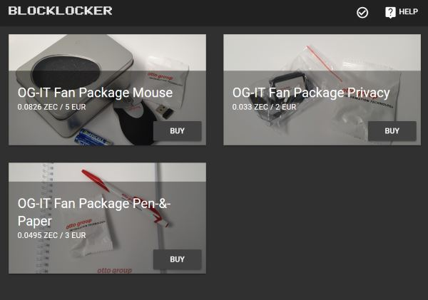

# Shop Front End

> This is the front end of the Blocklocker project. It is a simple Vue.js based web application using Google's material design.



## Requirements

The front end can also be installed on the same computer as the back end.


## Installation

Install nodejs and npm as root:

```
curl -sL https://deb.nodesource.com/setup_10.x | bash -
apt-get update && apt-get install npm
npm install -g npm@latest
```


### Start


#### Development

Change shop back end `target` url:

    nano -w vue.config.js

Compiles and hot-reloads for development (this creates a webserver at 'localhost:8080')

    npm install
    npm run serve


#### Production

Compiles and minifies for production (this creates a 'dist' folder which contains everything)

    npm install
    npm run build

Copy front end app to nginx static html dir:

    cp -r dist/* /var/www/html/
